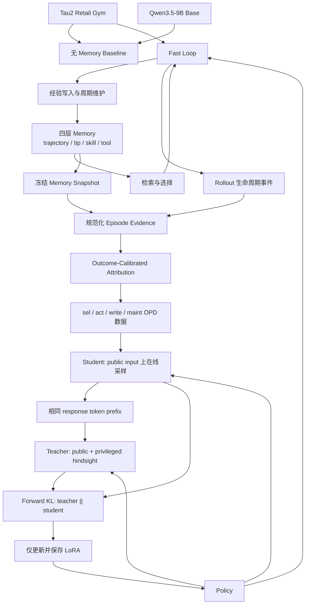

# Tau3 Retail Self-Evolving Agent

面向 Tau3 Retail 任务的工程实现：接入官方 Tau2 Retail 环境，通过四层 Memory、Fast Loop 和共享 Qwen3.5-9B LoRA 的 On-Policy Distillation（OPD）构建可持续积累经验的 Agent。

## 系统架构

项目将在线任务交互和模型更新拆为两条相互衔接的路径：Fast Loop 在 Retail 环境中积累和维护经验，Slow Loop 从同策略轨迹构建特权教师信号并更新当前 LoRA。



Fast Loop 和 Slow Loop 使用同一个模型谱系。一次 OPD 数据构建只能消费相同 `iteration`、`model_revision` 和 `adapter_revision` 的连续 train runs；LoRA 更新后，旧策略产生的 batch 不再用于下一轮训练。

## 代码组织

| 路径 | 职责 |
| --- | --- |
| `configs/default.yaml` | Tau2、模型、LoRA、rollout、Memory、归因、训练和评估器默认配置 |
| `src/tau3_retail_evolver/envs/` | Tau2 Retail 运行时探测、任务目录、split guard 和 Gym 适配器 |
| `src/tau3_retail_evolver/evaluation/` | Tau2 NL assertion evaluator 接入与 provider 配置 |
| `src/tau3_retail_evolver/memory/` | 四层 JSON Memory、Embedding、检索、原子写入、快照和维护操作 |
| `src/tau3_retail_evolver/fast_loop/` | Baseline/Fast Loop prompt、决策、动作编解码、生命周期事件和维护编排 |
| `src/tau3_retail_evolver/slow_loop/` | Evidence、任务分组、归因、泄漏检查、OPD 数据、token 对齐、KL 和 Trainer |
| `src/tau3_retail_evolver/pipeline/` | train-only task sampling、六态 iteration、artifact 哈希恢复和 checkpoint/Memory promotion |
| `src/tau3_retail_evolver/models/` | OpenAI-compatible Qwen policy、Qwen3.5 Transformers loader 和 PEFT LoRA 生命周期 |
| `scripts/` | Baseline、Fast Loop、OPD 数据构建/审计、LoRA 训练和完整 iteration 入口 |
| `tools/preflight/` | Tau2 Retail 环境与固定 revision 预检工具 |
| `tests/` | 单元测试、合成端到端测试以及显式开启的真实 Tau2/Qwen GPU 集成测试 |
| `docs/` | 分阶段设计、实施计划、验证说明和长期交付归档 |

## 技术设计

### Tau2 Retail 接入与数据边界

项目对外称为 Tau3 Retail，但当前官方环境来自 `sierra-research/tau2-bench`，代码导入官方 `tau2` Python 包。外部 checkout 不复制进本仓库，固定 revision 记录在 `external/tau2-bench.commit`：

```text
1901a301961cbbe3fd11f3e84a2a376530c759e3
```

固定 revision 的 Retail split 包含 74 个 `train`、40 个 `test` 和 114 个 `base` 任务。代码中的 split guard 强制执行以下边界：

- `train`：Fast Loop、Memory 更新、Outcome-Calibrated Attribution、OPD 数据构建和 LoRA 更新的唯一数据来源。
- `test`：只用于最终评测；不得生成训练样本、归因或参数更新，也不得用于选择 checkpoint 或调整超参数。
- `base`：只用于显式的官方全集复现，不能进入训练。
- 项目不从 `train` 额外切分 dev。开发期依靠单元测试、合成数据审计和小规模 train smoke 验证管线。

环境适配器规范化 `AgentGymEnv` 的 reset/step/close 生命周期，并保留官方 terminal reward 和 `reward_info`。默认非 solo 用户模拟器为 `deepseek/deepseek-v4-pro`；默认 NL assertion evaluator 为 `openrouter/openai/gpt-4.1`。

### 四层 Memory

Memory 遵循 OPD-Evolver 的文件式状态管理，不使用 SQLite：

| 层级 | 含义 |
| --- | --- |
| `trajectory` | 完整或压缩后的 Retail 交互轨迹 |
| `tip` | 局部警告、约束和启发式规则 |
| `skill` | 可复用的任务流程和策略 |
| `tool` | 可执行或结构化的动作模板 |

四层权威状态分别存储为普通 JSON；rollout 事件、候选/选择证据、Memory 操作、归因和 OPD 样本使用只追加 JSONL。默认 Agent namespace 为 `retail`，不同运行轮次持续读写同一个 Memory，不按 `run_id` 隔离经验；扩展到其他领域时使用新的 `agent_id`。

写操作先在内存副本完成 schema、版本、层级和 provenance 校验，再通过同目录临时文件、`flush/fsync` 和 `os.replace` 原子替换。模型只能输出类型化的 `create`、`update`、`merge`、`retire` 和 `lookup` 命令，不能直接编辑 JSON。

默认检索模型为 `Qwen/Qwen3-Embedding-0.6B`，候选数为 50，特权教师最多注入 20 条 Memory。每累计完成 `Q=30` 个 train tasks，Fast Loop 执行一次 repository maintenance。

### Fast Loop

每个 train task 的核心流程如下：

1. 根据任务、当前 observation 和环境元数据构造检索查询。
2. 从四层 Memory 检索候选集合 `C_t`。
3. 当前策略选择紧凑子集 `S_t`。
4. 将选中经验加入 action prompt，并在 Tau2 Retail 中执行 rollout。
5. 记录 observation、action、reward、候选、选择结果和终止状态。
6. 当前策略根据完整交互提出 Memory 写入命令。
7. 到达累计任务边界时执行 lookup、merge、retire 等维护命令。

`memory.enabled` 是严格布尔开关。设为 `false` 时仍运行相同任务、Qwen、seed 和用户模拟器，但跳过检索、选择、写入、Embedding 和维护，用于 Memory 消融。Memory-disabled run 不允许成为 Stage 5 的监督数据来源。

### Outcome-Calibrated Attribution 与 OPD 数据

归因只比较某条 Memory 实际进入候选集合的 train episodes。对于 Memory `m` 和匿名 task group `g`：

```text
Omega_plus_g(m)  = {t: g(t)=g and m in S_t}
Omega_minus_g(m) = {t: g(t)=g and m in C_t \ S_t}

rho_g(m)   = n_selected_g / (n_selected_g + n_not_selected_g)
delta_g(m) = mean(R_selected_g) - mean(R_not_selected_g)
A_hat(m)   = sum_g rho_g(m) * delta_g(m)

N_plus(m) = sum_g n_selected_g
gamma(m)  = 1 - 1 / sqrt(1 + N_plus(m))
V(m)      = alpha_tier(m) * gamma(m) * A_hat(m)
```

`V(m)` 是教师可见的特权 hindsight，不进入学生 public input。Stage 5 从规范化 evidence 构造四类在线采样合同：

- `sel`：从候选 Memory 中进行经验选择。
- `act`：基于公开任务和环境历史执行动作。
- `write`：根据任务结果提出可复用经验。
- `maint`：根据仓库状态和历史执行合并、保留或淘汰。

递归 leakage guard 禁止 attribution/value、golden evaluator 条件、test 数据路径和凭证进入 public input。Fast Loop 的历史响应只作为 provenance，不是固定标签；学生 completion 必须在 Slow Loop 训练时由当前策略现场生成。

### 共享策略 OPD 与 LoRA

Teacher 和 Student 共用一个 `Qwen/Qwen3.5-9B` Python 模型对象和当前 LoRA 参数存储：

- Student 只接收部署时可获得的 public input，并先进行 on-policy sampling。
- Teacher 加载同一个 LoRA，在 `eval()` 和 `torch.no_grad()` 下接收 public input 与 privileged hindsight。
- Teacher 和 Student 对齐到完全相同的学生 response token prefix。
- Teacher logits detach，基础模型始终冻结，只允许 LoRA 参数产生梯度。
- 损失是在学生响应位置计算的全词表 forward KL：`KL(teacher || student)`，log-softmax 在 FP32 中完成。

项目不使用普通 causal SFT，也不把该过程实现为自蒸馏或离线蒸馏。固定 LoRA 合同为：

```yaml
lora:
  use_peft: true
  lora_r: 32
  lora_alpha: 64
  lora_dropout: 0.05
training:
  target_modules: all-linear
```

初始 LoRA 为零影响初始化；adapter 合同记录基础模型全部可用线性层和 PEFT 实际目标实例，禁止层过滤或排除模块。Checkpoint 只保存 adapter、optimizer、RNG 和 lineage，不保存 Qwen 基础权重；恢复训练只接受最高的已发布 step。

### Iteration 协同演化

Stage 7 将一次学习迭代固定为以下状态序列：

```text
created -> rollout_complete -> attribution_complete
        -> dataset_complete -> training_complete -> promoted
```

每个状态只在对应 artifact 已发布、train-only 扫描通过并记录 SHA-256 后推进。恢复时重新计算所有已完成产物的哈希，不重跑已经提交的阶段；不完整 adapter、断裂的 Memory snapshot 或不连续的父子 revision 不能进入 `promoted`。下一轮必须继承上一轮 promotion 中的 checkpoint、adapter revision、Memory snapshot 和累计 train task 数。

任务 curriculum 使用 `training.seed` 与 `iteration` 共同生成确定性随机序列，生产默认每轮覆盖全部 74 个官方 train tasks；`pipeline.iteration_task_count` 可在 smoke 阶段缩小任务数量。`sel/act/write/maint` 使用同一个均衡 round-robin 调度，只循环已有类别，不伪造缺失的 write 或 maintenance 样本。

## 实验设计

### 数据使用原则

- 所有学习行为只发生在官方 `train`。
- `test` 在主流程和超参数固定后使用，不反馈训练。
- `base` 只用于单独标记的官方全集复现。
- 不划分 dev，也不依据 test 结果选择 LoRA checkpoint。
- 同一次对比必须固定 Tau2 commit、split hash、任务顺序、用户模拟器、NL evaluator、Qwen revision、seed set 和最大 episode 步数。

### 主实验矩阵

| 实验 | LoRA | 训练 Memory | 评测 Memory | 用途 |
| --- | --- | --- | --- | --- |
| Base Qwen Baseline | 无 | 无 | 无 | 测量基础 Qwen 的 Retail 能力 |
| Fast Loop / Memory Off | 当前策略 | 关闭 | 无 | 隔离 Memory 生命周期的贡献 |
| Fast Loop / Memory On | 当前策略 | 开启 | 训练 Memory | 测量检索、选择、写入和维护收益 |
| Trained LoRA / No Memory | 训练后 | 来自 train | 关闭 | 隔离 Slow Loop 参数更新的贡献 |
| Trained LoRA / `test_static` | 训练后 | 来自 train | 冻结 train snapshot，只读 | 测量部署时使用已学习 Memory 的效果 |
| Trained LoRA / `test_streaming` | 训练后 | 来自 train | 空白隔离 Memory，可在 test stream 内演化 | 对齐论文的流式自进化评测协议 |

`test_static` 和 `test_streaming` 是评测协议设计。Streaming Memory 只能写入独立 quarantine，训练 loader 必须拒绝读取，防止 test 经验回流。

主流程稳定后再进行 selection、writing 和 maintenance 单模块消融。Memory 开关实验必须复用相同 Qwen、任务顺序、seed 和用户模拟器；不得用不同运行条件替代真正的组件消融。

### 指标与重复实验

最终评测保留 Tau2 官方 evaluator，不重新实现 reward。报告至少包括：

- task count、completed count、mean reward 和 success rate。
- 逐任务 reward、`reward_info` 和 failure category。
- episode step count、tool/response parse-error rate。
- checkpoint、模型 revision、Tau2 commit、split hash、精确 test task IDs、任务顺序、用户模拟器、seed 和 Memory 协议。

单任务或五任务验证可以只运行一个 trial；最终报告默认每个 test task 运行四个带 seed 的 trials。只有控制变量完全一致的 runs 才能进入横向比较。

## 使用指南

### 1. 安装项目与 Tau2 Retail

项目要求 Python `>=3.12,<3.14`。从仓库根目录执行：

```bash
python -m pip install -U pip
git clone https://github.com/sierra-research/tau2-bench external/tau2-bench
TAU2_REVISION=$(cat external/tau2-bench.commit)
git -C external/tau2-bench checkout "$TAU2_REVISION"
python -m pip install -e "external/tau2-bench[gym]"
python -m pip install -e .
```

PowerShell 使用对应写法：

```powershell
python -m pip install -U pip
git clone https://github.com/sierra-research/tau2-bench external/tau2-bench
$Tau2Revision = (Get-Content external/tau2-bench.commit).Trim()
git -C external/tau2-bench checkout $Tau2Revision
python -m pip install -e "external/tau2-bench[gym]"
python -m pip install -e .
```

LoRA 训练机器还需要 training extra：

```bash
python -m pip install -e ".[training]"
```

### 2. 配置模型服务与凭证

Rollout 使用 Qwen 的 OpenAI-compatible endpoint。默认用户模拟器和 NL evaluator 分别读取 DeepSeek 与 OpenRouter 凭证。PowerShell 示例：

```powershell
$env:QWEN_BASE_URL = "http://127.0.0.1:8000/v1"
$env:QWEN_API_KEY = "EMPTY"
$env:OPENROUTER_API_KEY = Read-Host "OpenRouter API Key"
$env:DEEPSEEK_API_KEY = Read-Host "DeepSeek API Key"
$env:QWEN_MODEL_REVISION = "<immutable-qwen-revision>"
```

凭证只配置在启动 rollout 的机器环境变量中，不得写入 YAML、命令参数或运行日志。核心默认配置位于 `configs/default.yaml`，可复制配置文件进行 Memory 消融，或使用训练命令的重复 `--set key=value` 覆盖。

### 3. Tau2 Retail 预检

先确认 checkout revision、split、任务和 Gym runtime：

```powershell
python -m tools.preflight.check_tau2_retail `
  --config configs/default.yaml `
  --split train `
  --task-id 0 `
  --inspect
```

真实 Tau2 集成门禁通过环境变量显式开启：

```powershell
$env:RUN_TAU2_INTEGRATION = "1"
python -m pytest tests/integration/test_real_tau2_retail.py -q
```

### 4. 运行无 Memory Baseline

```powershell
python -m scripts.run_baseline `
  --config configs/default.yaml `
  --split train `
  --task-id 0 `
  --run-id baseline-train-0 `
  --qwen-base-url $env:QWEN_BASE_URL `
  --model-revision $env:QWEN_MODEL_REVISION
```

每次执行必须使用新的 `--run-id`。Baseline 不读取 Memory，也不加载训练 adapter，用于建立基础 Qwen 对照。

### 5. 运行 Fast Loop

单任务 smoke：

```powershell
python -m scripts.run_fast_loop `
  --config configs/default.yaml `
  --split train `
  --task-id 0 `
  --run-id fast-loop-train-0 `
  --model-revision $env:QWEN_MODEL_REVISION `
  --completed-train-tasks-before 0
```

连续五任务：

```powershell
python -m scripts.run_fast_loop `
  --config configs/default.yaml `
  --split train `
  --task-id 0 --task-id 1 --task-id 2 --task-id 3 --task-id 4 `
  --run-id fast-loop-train-0-4 `
  --model-revision $env:QWEN_MODEL_REVISION `
  --adapter-revision "<immutable-adapter-revision>" `
  --completed-train-tasks-before 0
```

`--completed-train-tasks-before` 是同一 `agent_id` 在本次运行前累计成功完成的 train task 数。若本次开始前已完成 25 个任务，五任务运行使用 `25`，并在累计第 30 个任务后触发 maintenance。

Memory 消融使用配置副本：

```yaml
memory:
  enabled: false
```

### 6. 构建并审计 OPD 数据

Source runs 必须显式列出，且具有连续 Memory snapshot、相同 iteration 和模型/adapter revision：

```powershell
python -m scripts.build_opd_dataset `
  --config configs/default.yaml `
  --source-run runs/fast-loop-train-0-4 `
  --dataset-build-id opd-iter0-001 `
  --output-root runs `
  --project-root .
```

独立审计重新加载 source run、官方 split 和冻结 Memory snapshot，重建 evidence、归因与四类样本：

```powershell
python -m scripts.audit_opd_dataset `
  --dataset-dir runs/opd-iter0-001/slow_loop `
  --project-root .
```

审计退出码 `0` 表示数据满足 lineage、hash、public/privileged 隔离和在线采样合同。

2026-07-23 已在 AutoDL 完成真实五任务 Memory-enabled schema-2 验证。两个连续 source runs 成功构建 `opd-iter0-5tasks-20260723g`，独立审计返回 `passed=true`；产物包含 5 条 episode evidence、11 条 Memory score、4 条 `sel` 和 1 条 `write`。本次小样本未产生 `act`，且未达到 `Q=30`，因此没有 `maint`；四类 builder 的非空与确定性重建继续由合成集成测试覆盖。

### 7. AutoDL 上运行 LoRA OPD

训练直接由 Transformers 加载 Qwen，不经过 vLLM。先停止 vLLM 释放 GPU 显存：

```bash
pkill -f 'vllm serve' || true
nvidia-smi
```

复用已经下载的 Hugging Face cache，并固定 Stage 5 manifest 对应的模型与 adapter revision：

```bash
export HF_HOME=/root/autodl-tmp/huggingface
export HF_HUB_OFFLINE=1
export MODEL_REVISION='<immutable-qwen-hugging-face-commit>'
export ADAPTER_REVISION='<stage-5-source-adapter-revision>'
export DATASET_DIR='/root/autodl-tmp/tau3-retail-evolver/runs/opd-iter0-001/slow_loop'
export OUTPUT_DIR='/root/autodl-tmp/tau3-retail-evolver/runs/opd-training-0001'
```

先执行不加载 Qwen/PEFT 的 dry-run。它会审计 Stage 5 数据、lineage、配置与输出目录：

```bash
python -m scripts.train_opd_lora \
  --config configs/default.yaml \
  --dataset-dir "$DATASET_DIR" \
  --output-dir "$OUTPUT_DIR" \
  --model-revision "$MODEL_REVISION" \
  --adapter-revision "$ADAPTER_REVISION" \
  --set training.per_device_batch_size=1 \
  --set training.gradient_accumulation_steps=8 \
  --dry-run
```

Dry-run 通过后运行真实 BF16 训练：

```bash
python -m scripts.train_opd_lora \
  --config configs/default.yaml \
  --dataset-dir "$DATASET_DIR" \
  --output-dir "$OUTPUT_DIR" \
  --model-revision "$MODEL_REVISION" \
  --adapter-revision "$ADAPTER_REVISION" \
  --set training.per_device_batch_size=1 \
  --set training.gradient_accumulation_steps=8
```

### 8. 恢复训练

只允许从最高的已发布 optimizer-step checkpoint 恢复：

```bash
export CHECKPOINT="$OUTPUT_DIR/checkpoints/step-00000001"

python -m scripts.train_opd_lora \
  --config configs/default.yaml \
  --dataset-dir "$DATASET_DIR" \
  --output-dir "$OUTPUT_DIR" \
  --model-revision "$MODEL_REVISION" \
  --adapter-revision "$ADAPTER_REVISION" \
  --set training.per_device_batch_size=1 \
  --set training.gradient_accumulation_steps=8 \
  --resume-from "$CHECKPOINT" \
  --dry-run
```

确认后移除 `--dry-run` 执行恢复。Trainer 会加载该 checkpoint 的 adapter、optimizer 和 Python/Torch RNG 状态。

### 9. 运行完整 Fast/Slow Iteration

Iteration 0 必须显式声明当前零影响 LoRA revision 和此前累计完成的 train task 数。以下命令先运行五任务 smoke，并在数据集独立审计通过后暂停：

```powershell
python -m scripts.run_iteration `
  --config configs/default.yaml `
  --iteration-id iteration-0000 `
  --iteration 0 `
  --model-revision $env:QWEN_MODEL_REVISION `
  --adapter-revision "<zero-impact-adapter-revision>" `
  --completed-train-tasks-before 0 `
  --task-count 5 `
  --stop-after dataset_complete
```

在单 GPU 机器上，此时停止 vLLM 释放显存，然后使用相同参数移除 `--stop-after` 再次执行。状态机会验证已完成 artifact，并直接从 LoRA 训练继续。若 rollout endpoint 和训练 GPU 相互独立，可以省略暂停参数一次执行到底。

下一轮只需要指定上一轮目录；adapter、checkpoint、Memory snapshot 和累计任务数会从 promotion manifest 继承：

```powershell
python -m scripts.run_iteration `
  --config configs/default.yaml `
  --iteration-id iteration-0001 `
  --iteration 1 `
  --model-revision $env:QWEN_MODEL_REVISION `
  --parent-iteration-dir runs/iterations/iteration-0000 `
  --task-count 5 `
  --stop-after dataset_complete
```

不传 `--task-count` 时使用配置中的生产默认值 74。真实五任务 Memory-enabled build/audit gate 和 Qwen3.5-9B 单步 GPU update gate 均已通过；真实 30 任务四类样本覆盖与完整真实多 iteration 仍在扩大数据采集和 Stage 8 验收实验中执行。

### 10. 测试

不下载大模型即可运行完整本地测试：

```bash
python -m pytest -q
```

真实 Qwen3.5 GPU smoke 只读取本地缓存，不主动下载模型：

```bash
export RUN_OPD_GPU_SMOKE=1
export OPD_GPU_SMOKE_MODEL_REVISION="$MODEL_REVISION"
python -m pytest tests/integration/test_opd_gpu_smoke.py -q
```

2026-07-23 已在 RTX 4090 48GB 上完成该 gate：固定 revision 的 Qwen3.5-9B 以 BF16 执行 1 个 optimizer step，forward KL 有限，LoRA 产生非零梯度与参数更新，基础模型无梯度；保存的 adapter 含 496 个 tensor，并通过训练前后逐 tensor 重载一致性检查。详见 [Stage 6 OPD GPU 验证记录](docs/stage-6-opd-gpu-validation.md)。

## 参考资料

- [OPD-Evolver: Cultivating Holistic Agent Evolver via On-Policy Distillation](https://arxiv.org/abs/2606.17628v1)
- [OPD-Evolver 官方代码仓库](https://github.com/bingreeky/opd-evolver)
- [Tau2-bench](https://github.com/sierra-research/tau2-bench)
- [Tau2 Gym Adapter 文档](https://github.com/sierra-research/tau2-bench/blob/main/src/tau2/gym/README.md)
- 本项目固定的 Tau2 revision：`1901a301961cbbe3fd11f3e84a2a376530c759e3`
