# Tau3 Agent Evolver

> 面向 Retail / Airline 长程工具调用任务的自进化 Agent：用 **Fast Loop Memory** 在上下文中积累经验，用 **On-Policy Distillation（OPD）** 将交互经验沉淀为 Qwen3.5-9B 的 LoRA 能力。

[](pyproject.toml)
[](https://huggingface.co/Qwen/Qwen3.5-9B)
[](configs/default.yaml)
[](https://github.com/sierra-research/tau2-bench)

## 项目概览

传统工具型 Agent 在单次任务结束后不会保留经验；只依赖 Prompt Memory，又容易产生经验膨胀、重复召回和上下文成本上升。Tau3 Agent Evolver 将这两个问题拆成互相协作的双循环：

- **Fast Loop：经验进化。** 从历史 Memory 中检索、选择并注入与当前任务相关的经验；任务结束后根据完整轨迹和结果写入新经验，并周期性合并、保留或淘汰旧经验。
- **Slow Loop：策略进化。** 将同策略 rollout 规范化为 task-level OPD 数据，让冻结 Teacher 利用结果归因等特权信息，对 Student 的在线采样轨迹进行 token-level 指导，只更新 LoRA。
- **严格实验隔离。** `train` 负责 Memory 和权重学习，`test` 只读取冻结 Memory Snapshot 与固定 Checkpoint，不向训练流程回流。
- **跨领域复用。** Retail 提供完整训练与消融实验；Airline 复用相同 Fast/Slow Loop，仅隔离领域配置、任务分组和 Memory namespace。

项目以 `Qwen/Qwen3.5-9B` 为基础模型，接入官方 `tau2-bench` Retail / Airline 环境。用户模拟器和 NL evaluator 固定为 `deepseek/deepseek-v4-pro`。

## 快速开始

以下命令均在项目根目录执行。项目只提供一个在线执行入口 `tau3 run`；
Slow Loop 不会按 iteration 或任务数自动启动，只能由管理员显式执行
`tau3 slow-loop build / audit / train`。

### 1. 准备环境

项目需要 Python 3.12 或 3.13、可用的 CUDA 环境，以及一个能够被 Python
导入的 Tau2 checkout。首次安装可以执行：

```bash
git clone https://github.com/sierra-research/tau2-bench external/tau2-bench
python -m pip install -e external/tau2-bench
python -m pip install -e ".[training]"
cp .env.example .env
```

在 `.env` 中填写 `DEEPSEEK_API_KEY`。该凭证同时供 Tau2 用户模拟器和 NL
assertion evaluator 使用，不要把真实 Key 写进 YAML、命令行或提交到仓库。

Fast Loop 通过 `configs/default.yaml` 中的 OpenAI-compatible 地址访问 Agent
模型。默认地址是 `http://127.0.0.1:8000/v1`，模型名是
`Qwen/Qwen3.5-9B`，上下文长度固定为 131072。一个经过验证的本地 vLLM
启动方式如下；使用远程兼容服务时，只需同步修改配置中的地址、模型名和凭证：

```bash
vllm serve Qwen/Qwen3.5-9B \
  --served-model-name Qwen/Qwen3.5-9B \
  --host 127.0.0.1 \
  --port 8000 \
  --dtype bfloat16 \
  --max-model-len 131072 \
  --enable-auto-tool-choice \
  --tool-call-parser qwen3_coder \
  --reasoning-parser qwen3 \
  --generation-config vllm \
  --language-model-only
```

启用 Memory 时还会按需加载 `Qwen/Qwen3-Embedding-0.6B`。正式运行前应确保
基础模型和 Embedding 模型已经下载，或能够从当前 Hugging Face 环境获取。

### 2. 在 train 集积累经验

下面的命令运行 Retail 的完整官方 train split。`--memory` 同时打开 Memory
检索和 train-only 写入；同领域的后续 train run 会继续使用并更新同一个
`retail` namespace：

```bash
tau3 run \
  --benchmark retail \
  --mode train \
  --memory \
  --config configs/default.yaml \
  --run-id retail-train-001 \
  --output-root runs
```

任务结束后主要产生：

```text
runs/retail-train-001/run.json
runs/retail-train-001/episodes.jsonl
history/agents/retail/memory/
```

`run.json` 的 `memory.output_snapshot_id` 是本轮结束时发布的不可变 Memory
Snapshot ID；后面的 test 和 Slow Loop 都以该 lineage 为准。Fast Loop
Maintenance 属于 train 流程，每累计配置数量的已完成 train task 自动触发，
不需要手动运行。

如果只想先验证并发链路，在命令中加入 `--debug`。Debug 会从对应 split
选择 `execution.max_concurrency` 条确定性任务，默认是 3 条，并把经验隔离到
`retail-debug` namespace：

```bash
tau3 run \
  --benchmark retail \
  --mode train \
  --debug \
  --memory \
  --config configs/default.yaml \
  --run-id retail-debug-train-001 \
  --output-root runs
```

若要运行不读取、也不积累经验的基线，将 `--memory` 替换为
`--no-memory`。每个 `--run-id` 必须唯一，已有运行目录不会被覆盖。

### 3. 在 test 集验证 Memory 效果

test 必须显式读取一个冻结 Snapshot，且整个过程只读，不写入 Memory、
不运行 Maintenance。先从 train run 的 `run.json` 取得
`memory.output_snapshot_id`，再执行：

```bash
tau3 run \
  --benchmark retail \
  --mode test \
  --memory \
  --memory-source retail \
  --memory-snapshot <snapshot-id> \
  --config configs/default.yaml \
  --run-id retail-test-with-memory-001 \
  --output-root runs
```

`--memory-source` 指定 Memory namespace；省略时默认使用当前 benchmark
的同名 namespace。它也支持跨领域验证，例如在 Airline test 中读取 Retail
Memory：

```bash
tau3 run \
  --benchmark airline \
  --mode test \
  --memory \
  --memory-source retail \
  --memory-snapshot <retail-snapshot-id> \
  --config configs/default.yaml \
  --run-id airline-test-retail-memory-001 \
  --output-root runs
```

验证 Debug Train 产生的经验时，在 test 命令中同时加入 `--debug`，并把
`--memory-source` 设为 `retail-debug`。对照基线使用相同 test 配置与
`--no-memory`；两次运行的通过率、奖励和 Memory 命中统计都在各自
`run.json` 的 `summary` 中。

### 4. 手动启动 Slow Loop 训练

Slow Loop 只消费 `mode=train + memory enabled` 的 Source Run，test 制品不会
进入训练。第一步把一个或多个连续 train run 转换为 OPD Dataset；需要多个
来源时重复传入 `--source-run`：

```bash
tau3 slow-loop build \
  --source-run runs/retail-train-001 \
  --dataset-build-id retail-opd-001 \
  --config configs/default.yaml \
  --output-root runs
```

构建过程会先在临时目录生成数据并完成内部 Audit，只有审计通过才会原子发布到
`runs/retail-opd-001/slow_loop/`。开始训练前可以再次独立审计：

```bash
tau3 slow-loop audit \
  --dataset-dir runs/retail-opd-001/slow_loop
```

先使用 `--dry-run` 核对数据 lineage、四类样本数量和训练计划，不加载模型：

```bash
tau3 slow-loop train \
  --dataset-dir runs/retail-opd-001/slow_loop \
  --output-dir runs/retail-opd-001/training \
  --model-revision Qwen/Qwen3.5-9B \
  --adapter-revision zero-impact-init-v1 \
  --config configs/default.yaml \
  --dry-run
```

首次从基础模型产生的 train run 使用 `zero-impact-init-v1`；若 Source Run
已经指定了 `--checkpoint`，则 `--model-revision` 和 `--adapter-revision`
必须与 `dataset_manifest.json` 的 `policy_lineage` 完全一致。

确认无误后停止占用同一 GPU 的 vLLM 服务，移除 `--dry-run` 启动真实训练：

```bash
tau3 slow-loop train \
  --dataset-dir runs/retail-opd-001/slow_loop \
  --output-dir runs/retail-opd-001/training \
  --model-revision Qwen/Qwen3.5-9B \
  --adapter-revision zero-impact-init-v1 \
  --config configs/default.yaml
```

训练会依次产生 `sel`、`act`、`write`、`maint` 四个独立 LoRA checkpoint，
并在输出根目录发布过程状态 `suite_manifest.json` 和最终 Bundle
`training_manifest.json`。训练中断后用完全相同的命令重启，训练套件会从各能力
最近的有效 checkpoint 继续。

Debug Train 制品只能进入 Debug Slow Loop：`build` 和 `train` 两条命令都必须
加入 `--debug`。这一路径用于验证数据和训练管线是否可运行，不能作为正式模型
效果结论。

## 系统架构

```mermaid
flowchart LR
    Task["Tau2 Retail / Airline task"] --> Retrieve["Embedding retrieval"]
    Memory["Four-tier Memory"] --> Retrieve
    Retrieve --> Select["Tier quota + MMR + Selector"]
    Select --> Rollout["Qwen3.5-9B rollout"]
    Rollout --> Outcome["Trajectory + reward + feedback"]
    Outcome --> Write["Write reusable experience"]
    Write --> Maintain["Merge / retain / retire"]
    Maintain --> Memory

    Outcome --> Evidence["Canonical Episode Evidence"]
    Memory --> Evidence
    Evidence --> Attribution["Outcome-calibrated attribution"]
    Attribution --> Dataset["Task-level OPD datasets"]
    Dataset --> Teacher["Frozen Teacher + privileged context"]
    Dataset --> Student["On-policy Student + public context"]
    Teacher --> KL["Forward KL"]
    Student --> KL
    KL --> LoRA["Selector / Executor / Writer / Maintainer LoRAs"]
    LoRA --> Rollout
```



在线执行与手动 Slow Loop 形成以下闭环：

```text
tau3 run --mode train -> Memory Snapshot + episodes.jsonl
                      -> 手动构建并审计 OPD Dataset
                      -> tau3 slow-loop -> LoRA Checkpoint
```

每次在线运行只发布两个正式制品：`run.json` 保存运行级配置、lineage、Snapshot、
自动 Maintenance 的压缩记录、聚合指标和制品哈希；`episodes.jsonl` 每个任务一行，
保存标准化轨迹、终局评估及 Memory 检索、选择和写入证据。Tau2 原始 Simulation、
独立 Events、Results 和 Evaluation 文件不重复发布。

## Fast Loop：让经验可积累、可检索、可治理

### 四层 Memory

Memory 不只是历史对话缓存，而是按照复用粒度拆分的结构化经验库：

| 层级 | 保存内容 | 典型用途 |
| --- | --- | --- |
| `trajectory` | 运行时代码逐 task 记录的 observation、action/arguments、result、reward 与终止状态 | 参考相似任务的真实端到端执行过程 |
| `tip` | 条件、建议和原因组成的原子规则 | 提醒认证、确认、状态检查等关键约束 |
| `skill` | 目标、有序步骤和成功条件组成的工作流 | 复用退货、换货、订单修改等多步能力 |
| `tool` | 针对真实 Tau2 工具提炼的可执行调用方法、前置条件、完整参数绑定规则、预期效果与示例 | 选中后注入对应 function schema，降低工具选错、参数错误和非法调用 |

四层权威状态使用 **JSON** 保存；rollout、Memory 选择、写入、维护、归因和训练样本使用只追加 **JSONL**。每条 Memory 同时记录：

- 可读正文与用于检索的 `retrieval_text`；
- typed payload、Embedding 和 tier schema；
- 来源任务、run、snapshot 与版本信息；
- 使用次数、成功次数和软删除状态。

训练轮次共享同一个领域 Memory，经验会持续积累；Retail 与 Airline 使用不同 `agent_id`，避免跨领域污染。测试阶段只读冻结 Snapshot，禁止写入和维护。

### 检索、选择与维护

1. 使用 `Qwen3-Embedding-0.6B` 从四层 Memory 召回候选。
2. 先按 tier 配额保留不同类型的经验，再通过 MMR 在相关性与多样性之间重排。
3. Selector 从候选集合中选择最多 20 条 Memory；被选中的 Tool Memory 写入对应原生工具的 function description，随 `tools` 参数传给 Qwen，其余层进入 Memory 上下文。
4. rollout 结束后，Trajectory Memory 一律由运行时代码从真实轨迹写入；LLM writer 只在结果门控允许时提炼 `tip`、`skill`、`tool`，不能生成或改写 trajectory。
5. 每累计 30 个 train task 触发一次 Maintenance，对高相似、低价值或长期未使用的经验执行 merge、retain、retire；trajectory 是不可合并的原始执行记录。

这套设计同时处理两个问题：Embedding 负责“找得到”，tier 配额与 MMR 负责“不要总找到同一类”，Maintenance 负责“经验库不会无限增长”。

## Slow Loop：从交互日志构造 OPD 监督

### Episode Evidence 与数据血缘

Fast Loop 为每个任务保留：

```text
E_t = (task, candidates, selected memories, trajectory, reward, memory delta)
```

Slow Loop 以 `run.json + episodes.jsonl` 作为唯一 Source Run 契约。Loader 先校验
Episode 文件哈希、Train Split、模型与 Memory Snapshot lineage，再把每个任务行直接
转换为 `EpisodeEvidence`，并把 `run.json` 中的压缩 Maintenance 记录转换为
`MaintenanceEvidence`；不再从独立事件流拼装生命周期，也不再依赖 Results 文件。

OPD Dataset 先在临时目录构建，Audit 会重新检查来源、Schema、哈希、Snapshot、
Attribution 和样本可重建性。只有审计通过的数据集才会被原子发布；训练启动前还会
再次执行 Audit。

### Outcome-Calibrated Attribution

同一条 Memory 被选择时的任务结果，与它进入候选但未被选择时的结果进行对照，得到结果校准后的价值：

```text
A(m) = weighted_mean(reward_selected - reward_not_selected)
V(m) = tier_prior(m) * confidence(usage_count) * A(m)
```

`V(m)`、完整结果、Memory 变化和后续维护行为只对 Teacher 可见；Student 只能看到真实部署时可获得的任务、对话、工具和候选 Memory。递归 leakage guard 会阻止 evaluator 条件、test 路径、归因分数和凭证进入 Student Prompt。

### 四类 task-level 数据与四套 LoRA

每类训练数据都以任务为单位，而不是把同一 episode 的每个 action 展开成独立样本：

| 数据集 / LoRA | 学习目标 | 当前样本数 |
| --- | --- | ---: |
| `sel` / Selector | 从候选经验中选择真正有帮助的 Memory | 198 |
| `act` / Executor | 基于任务、对话和已选 Memory 完成整条执行轨迹 | 98 |
| `write` / Writer | 从任务结果中提炼可复用经验 | 50 |
| `maint` / Maintainer | 合并、保留或淘汰 Memory | 7 |
| **合计** | **一轮自然分布训练，不做跨类补齐** | **353** |

四类能力分别训练独立 LoRA。每个能力内部：

- Teacher 与 Student 使用同一个 Qwen3.5-9B 基座和该能力当前的 LoRA；
- Student 先基于 public context 进行 on-policy sampling；
- Teacher 在 `eval()`、`torch.no_grad()` 下读取额外 privileged context；
- Teacher 与 Student 对齐到同一段 Student response token prefix；
- 基座参数冻结，只更新 PEFT LoRA；损失为 `KL(teacher || student)`。

链路联调可显式使用 `tau3 slow-loop build --debug` 和
`tau3 slow-loop train --debug` 消费隔离的 Debug Train 制品。Debug 数据不足时，空
类别只发布带明确标记的零影响初始化 Adapter，非空类别仍执行真实 OPD 优化；这类
Bundle 仅证明流程可运行，不能当作正式训练结果。

```yaml
use_peft: true
lora_r: 32
lora_alpha: 64
loss: forward_kl
dtype: bfloat16
```

Iteration 0 使用零影响 LoRA 初始化。本轮单 epoch 已完成 `353/353` 条样本训练，得到四个独立 Adapter：`sel`、`act`、`write`、`maint`。

## 实验设计

### 数据边界

- Retail：74 个 `train`、40 个 `test`；不额外切分 dev。
- Fast Loop 使用相同基础策略在 74 个 train task 上运行三次，seed 为 `42/43/44`，Memory 跨 pass 累积并最终冻结为 S1。
- 三次 train pass 产生的有效 episode 只用于归因、OPD 数据构建和 LoRA 更新。
- 四组 test 实验共享相同任务顺序、seed、模型 revision、用户模拟器、NL evaluator 和最大步数。
- B/C 读取同一份只读 S1；C/D 使用同一组训练后 Adapter。

### 2×2 主实验

| Cell | 模型权重 | Test Memory | 回答的问题 |
| --- | --- | --- | --- |
| A `base_no_memory` | Base Qwen3.5-9B | 关闭 | 裸模型基线是多少？ |
| B `base_with_memory` | Base Qwen3.5-9B | 冻结 S1 | Fast Loop Memory 单独带来多少收益？ |
| C `opd_with_memory` | OPD LoRAs | 同一冻结 S1 | Memory 与 OPD 协同后的完整系统效果如何？ |
| D `opd_no_memory` | OPD Executor LoRA | 关闭 | 有多少经验被内化进模型权重？ |

主要对比分别为 `B-A`（Memory）、`D-A`（权重内化）、`C-B`（已有 Memory 时的 OPD 增益）和 `C-A`（完整系统）。

## 当前 Retail 实验结果

以下结果来自固定 Qwen revision、40 个官方 test task、单 trial、seed 42 的 Stage 8 冻结记录：

| Cell | 成功任务 | Pass@1 | 相对 A | 记录 Token 总量 | 平均 Token / 任务 |
| --- | ---: | ---: | ---: | ---: | ---: |
| A · Base，无 Memory | 16 / 40 | 40.0% | - | 3,852,883 | 96,322 |
| B · Base + S1 | 17 / 40 | 42.5% | +2.5 pp | 6,207,711 | 155,193 |
| D · OPD Executor，无 Memory | 18 / 40 | 45.0% | +5.0 pp | 3,884,814 | 97,120 |
| C · OPD LoRAs + S1 | 待执行 | 待执行 | - | - | - |

Token 按完整 evaluation telemetry 统计；Memory 组包含检索、选择以及 Memory 随对话历史重复进入 Agent Prompt 的端到端开销。

### S1 Memory 与训练指标

| 指标 | 数值 |
| --- | ---: |
| 活跃 Memory | 358 |
| `trajectory / tip / skill / tool` | 6 / 267 / 81 / 4 |
| Cell B 复用的不同 Memory | 71 |
| Memory 复用覆盖率 | 19.8% |
| task-level OPD 样本 | 353 |
| 训练 epoch | 1 |
| 独立 LoRA Adapter | 4 |

当前结果表明：

- 冻结 Memory 将 Pass@1 从 40.0% 提升到 42.5%，但端到端 Token 增加约 61%，说明后续仍需压缩重复 Memory 与注入长度。
- 不使用 Memory 时，Executor LoRA 将 Pass@1 提升到 45.0%，Token 成本基本保持在基础模型水平，验证了部分经验可以被内化进模型权重。
- Cell C 尚未执行，因此当前不能对 Memory 与 OPD 的最终协同效应作结论。

除 Pass@1 外，实验报告还记录平均 step、prompt/completion token、Memory 选择次数与唯一复用量、parse error、failure category、四类样本量、optimizer step、response token 和 Forward-KL 曲线。

## 跨领域迁移：Retail → Airline

Airline 不复制一套 Agent，而是复用相同环境适配、Fast Loop、Memory、OPD 数据和评测组件：

| 领域差异 | Retail | Airline |
| --- | --- | --- |
| Agent namespace | `retail` | `airline` |
| Task group | `retail-v2` | `airline-v2` |
| Train / Test | 74 / 40 | 30 / 20 |
| 领域配置 | `configs/default.yaml` | `configs/airline.yaml` |

Airline 的端到端接入与实验协议维护在 [`airline` 分支](https://github.com/juyixi/tau3-self-evolving-agent/tree/airline)。它验证了双循环、Memory schema、任务级 OPD 和四组消融协议能够在更换工具与业务规则后继续复用。

## 代码地图

| 模块 | 职责 |
| --- | --- |
| `src/tau3_evolver/fast_loop/` | Selection、Decision、Write、Maintenance 与共享 Prompt/Contract |
| `src/tau3_evolver/artifacts/` | `run.json`、`episodes.jsonl` 与凭证清理 |
| `src/tau3_evolver/benchmarks/` | 静态定义、Registry、Executor 与 Tau2 Agent Adapter |
| `src/tau3_evolver/execution/` | 类型化请求、权限、`run_domain` 批量执行与两文件落盘 |
| `src/tau3_evolver/memory/` | 四层 Memory、Embedding、MMR 检索、Snapshot 与原子写入 |
| `src/tau3_evolver/evaluation/` | 运行级指标和受控实验对比 |
| `src/tau3_evolver/slow_loop/` | Source Run、Evidence、归因、Audit、OPD 数据与 KL |
| `src/tau3_evolver/models/` | Qwen3.5、OpenAI-compatible client 与 PEFT LoRA 生命周期 |
| `src/tau3_evolver/cli.py` | 唯一 `tau3` 程序及在线/离线命令域 |

## 设计与实验文档

- [Retail Stage 8 实验协议](docs/evaluation_protocol.md)
- [Outcome Attribution 与 OPD 数据设计](docs/superpowers/specs/2026-07-20-stage-5-outcome-attribution-opd-dataset-design.md)
- [共享策略 OPD 实施计划](docs/superpowers/plans/2026-07-20-stage-6-shared-policy-opd.md)
- [Fast / Slow Loop 迭代设计](docs/superpowers/plans/2026-07-22-stage-7-iterative-fast-slow-loop.md)
- [Memory Maintenance 策略](docs/memory-maintenance-policy.md)
- [Airline 分支实验协议](https://github.com/juyixi/tau3-self-evolving-agent/blob/airline/docs/airline-evaluation-protocol.md)

## 参考

- [OPD-Evolver: Cultivating Holistic Agent Evolver via On-Policy Distillation](https://arxiv.org/abs/2606.17628v1)
- [OPD-Evolver 官方代码](https://github.com/bingreeky/opd-evolver)
- [Tau2-bench](https://github.com/sierra-research/tau2-bench)
- [Qwen3.5-9B](https://huggingface.co/Qwen/Qwen3.5-9B)

> 本项目中的 OPD 指 On-Policy Distillation：Teacher 使用同策略产生的轨迹和任务结果提供后验指导，但保持冻结；它不是将一个固定离线教师数据集蒸馏给 Student，也不是全参数微调。
